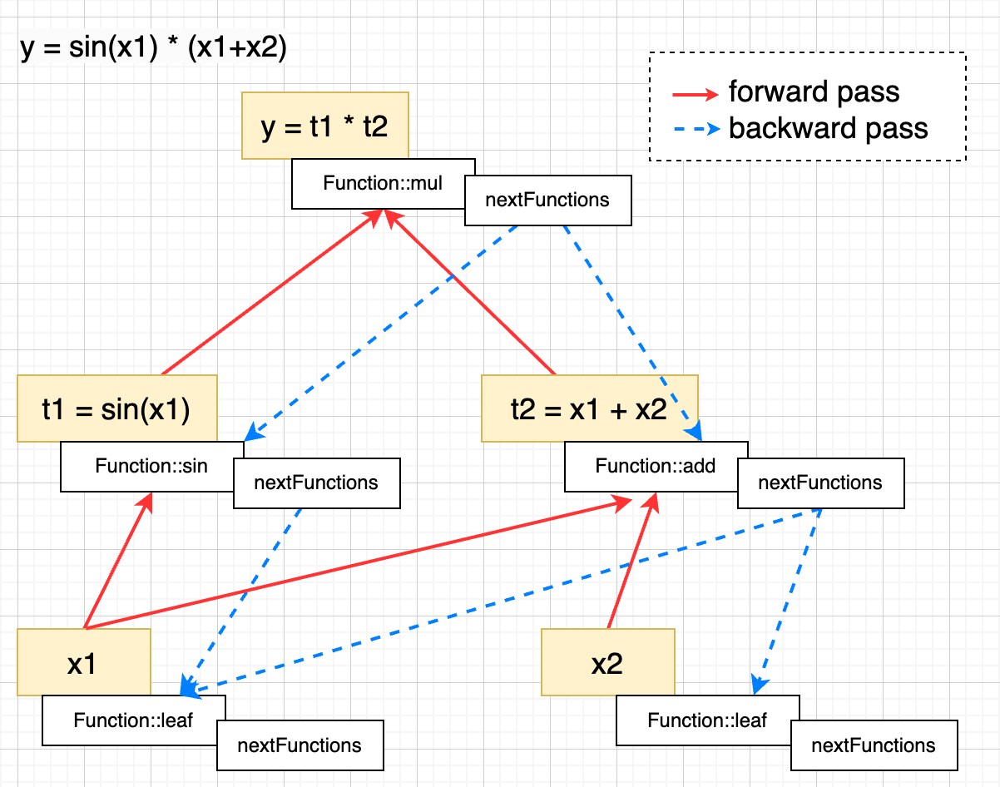

# TinyTorch

Tiny deep learning training framework implemented from scratch in C++ that follows PyTorch's API. For more details, see [Write a nn training framework from scratch](https://robot9.me/write-nn-framework-from-scratch-tinytorch/)

[](https://github.com/keith2018/TinyTorch/actions/workflows/cmake_linux.yml)
[](https://github.com/keith2018/TinyTorch/actions/workflows/cmake_macos.yml)
[](https://github.com/keith2018/TinyTorch/actions/workflows/cmake_windows.yml)

## Components

- Module
  - Linear
  - Conv2D
  - BatchNorm2D
  - MaxPool2D
  - Dropout
  - Softmax
  - LogSoftmax
  - Relu
  - Sequential
- Loss
  - MSELoss
  - NLLLoss
- Optimizer
  - SGD
  - Adagrad
  - RMSprop
  - AdaDelta
  - Adam
  - AdamW
- Data
  - Dataset
  - DataLoader
  - Transform

## Automatic differentiation



## MNIST training demo:
```c++
#include "Torch.h"

using namespace TinyTorch;

// https://github.com/pytorch/examples/blob/main/mnist/main.py
class Net : public nn::Module {
 public:
  Net() { registerModules({conv1, conv2, dropout1, dropout2, fc1, fc2}); }

  Tensor forward(Tensor &x) override {
    x = conv1(x);
    x = Function::relu(x);
    x = conv2(x);
    x = Function::relu(x);
    x = Function::maxPool2d(x, 2);
    x = dropout1(x);
    x = Tensor::flatten(x, 1);
    x = fc1(x);
    x = Function::relu(x);
    x = dropout2(x);
    x = fc2(x);
    x = Function::logSoftmax(x, 1);
    return x;
  }

 private:
  nn::Conv2D conv1{1, 32, 3, 1};
  nn::Conv2D conv2{32, 64, 3, 1};
  nn::Dropout dropout1{0.25};
  nn::Dropout dropout2{0.5};
  nn::Linear fc1{9216, 128};
  nn::Linear fc2{128, 10};
};

// Training settings
struct TrainArgs {
  // input batch size for training (default: 64)
  int32_t batchSize = 64;

  // input batch size for testing (default: 1000)
  int32_t testBatchSize = 1000;

  // number of epochs to train (default: 1)
  int32_t epochs = 1;

  // learning rate (default: 1.0)
  float lr = 1.f;

  // Learning rate step gamma (default: 0.7)
  float gamma = 0.7f;

  // disables CUDA training
  bool noCuda = false;

  // quickly check a single pass
  bool dryRun = false;

  // random seed (default: 1)
  unsigned long seed = 1;

  // how many batches to wait before logging training status
  int32_t logInterval = 10;

  // For Saving the current Model
  bool saveModel = false;
};

void train(TrainArgs &args, nn::Module &model, Device device,
           data::DataLoader &dataLoader, optim::Optimizer &optimizer,
           int32_t epoch) {
  model.train();
  Timer timer;
  timer.start();
  for (auto [batchIdx, batch] : dataLoader) {
    auto &data = batch[0].to(device);
    auto &target = batch[1].to(device);
    optimizer.zeroGrad();
    auto output = model(data);
    auto loss = Function::nllloss(output, target);
    loss.backward();
    optimizer.step();

    if (batchIdx % args.logInterval == 0) {
      timer.mark();
      auto currDataCnt = batchIdx * dataLoader.batchSize();
      auto totalDataCnt = dataLoader.dataset().size();
      auto elapsed = (float)timer.elapseMillis() / 1000.f;  // seconds
      LOGD("Train Epoch: %d [%d/%d (%.0f%%)] Loss: %.6f, Elapsed: %.2fs", epoch,
           currDataCnt, totalDataCnt, 100.f * currDataCnt / (float)totalDataCnt,
           loss.item(), elapsed);

      if (args.dryRun) {
        break;
      }
    }
  }
}

void test(nn::Module &model, Device device, data::DataLoader &dataLoader) {
  model.eval();
  Timer timer;
  timer.start();
  auto testLoss = 0.f;
  auto correct = 0;
  withNoGrad {
    for (auto [batchIdx, batch] : dataLoader) {
      auto &data = batch[0].to(device);
      auto &target = batch[1].to(device);
      auto output = model(data);
      testLoss += Function::nllloss(output, target, SUM).item();
      auto pred = output.data().argmax(1, true);
      correct +=
          (int32_t)(pred == target.data().view(pred.shape())).sum().item();
    }
  }
  auto total = dataLoader.dataset().size();
  testLoss /= (float)total;
  timer.mark();
  auto elapsed = (float)timer.elapseMillis() / 1000.f;  // seconds
  LOGD(
      "Test set: Average loss: %.4f, Accuracy: %d/%d (%.0f%%), Elapsed: "
      "%.2fs",
      testLoss, correct, total, 100. * correct / (float)total, elapsed);
}

void demo_mnist() {
  LOGD("demo_mnist ...");
  Timer timer;
  timer.start();

  TrainArgs args;

  manualSeed(args.seed);

  auto useCuda = (!args.noCuda) && Tensor::deviceAvailable(Device::CUDA);
  Device device = useCuda ? Device::CUDA : Device::CPU;

  auto transform = std::make_shared<data::transforms::Compose>(
      data::transforms::Normalize(0.1307f, 0.3081f));

  auto dataDir = "./data/";
  auto trainDataset = std::make_shared<data::DatasetMNIST>(
      dataDir, data::DatasetMNIST::TRAIN, transform);
  auto testDataset = std::make_shared<data::DatasetMNIST>(
      dataDir, data::DatasetMNIST::TEST, transform);

  if (trainDataset->size() == 0 || testDataset->size() == 0) {
    LOGE("Dataset invalid.");
    return;
  }

  auto trainDataloader = data::DataLoader(trainDataset, args.batchSize, true);
  auto testDataloader = data::DataLoader(testDataset, args.testBatchSize, true);

  auto model = Net();
  model.to(device);

  auto optimizer = optim::AdaDelta(model.parameters(), args.lr);
  auto scheduler = optim::lr_scheduler::StepLR(optimizer, 1, args.gamma);

  for (auto epoch = 1; epoch < args.epochs + 1; epoch++) {
    train(args, model, device, trainDataloader, optimizer, epoch);
    test(model, device, testDataloader);
    scheduler.step();
  }

  if (args.saveModel) {
    save(model, "mnist_cnn.model");
  }

  timer.mark();
  LOGD("Total Time cost: %lld ms", timer.elapseMillis());
}
```

## Build
```bash
mkdir build
cmake -B ./build -DCMAKE_BUILD_TYPE=Release
cmake --build ./build --config Release
```

## Demo
```bash
cd demo/bin
./TinyTorch_demo
```

## Test
```bash
cd build
ctest
```

## Dependencies
- `OpenBLAS` (optional for `gemm` on CPU mode) [https://github.com/OpenMathLib/OpenBLAS](https://github.com/OpenMathLib/OpenBLAS)

## License
This code is licensed under the MIT License (see [LICENSE](LICENSE)).
